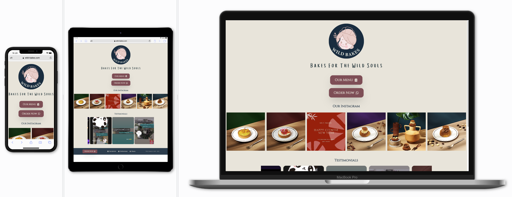

# Wild Bakes Landing Page Repository

👉 [https://wild-bakes.com](https://wild-bakes.com)


## Responsive layout



Developed by [Yeow Ying Sheng](https://yeowys.com) and [Okkar Min](https://okkarm.in) for [ Wild Bakes ](https://www.instagram.com/wild.bakes)

# 🥞 Technology Stack

- 🎞 Framework : NextJS
- 💄 UI Components : ChakraUI
- 🎬 Animations : Framer Motion

# Folder structure

```
wild-bakes-landing-page
┣━━ 📂 drafts              # Images of initial prototype drafts
┣━━ 📂 public              # Static assets (images, favicon)
┃ ┗━━ 📂 testimonial       # Images of WildBakes customer testimonials
┣━━ 📂 src
┃ ┣━━ 📂 components
┃ ┃ ┣━━ 📂 button
┃ ┃ ┣━━ 📂 introduction
┃ ┃ ┣━━ 📂 layout
┃ ┃ ┣━━ 📂 testimonial
┃ ┃ ┣━━ 📂 topsellers
┃ ┃ ┗━━ Insta.js
┃ ┣━━ 📂 pages
┃ ┃ ┣━━ _app.js
┃ ┃ ┣━━ _document.js       # SEO meta tags goes here
┃ ┃ ┗━━ index.js           # Single page site
┃ ┗━━ theme.js             # Sitewide theme configuration
┣━━ .gitignore
┣━━ README.md
┣━━ package-lock.json
┗━━ package.json
```

# 📑 Drafts

## Initial proposed draft


## Client requests after initial draft


